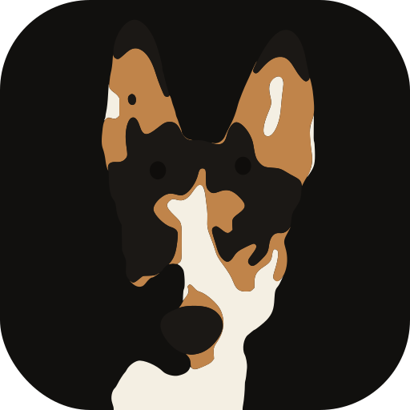

<p align="center">
  
</p>

<h1 align="center">OrbitCut</h1>

<p align="center">
  Finds the good bits in GoPro bikejoring footage and cuts them for Instagram.<br>
  Named for Orbit, who does most of the work.
</p>

---

Point it at a card of GoPro files and it will hash them, pull the telemetry,
build proxies, score every second of every ride from the sensors, propose the
clips worth watching, let you approve them in a browser, and render what
survives as 1080×1920 Reels from the original footage.

**The bet is that the camera already measured the action.** Every GoPro from
HERO5 writes a GPMF telemetry track — accelerometer at 200 Hz, gyro, GPS, and on
HERO8+ a per-frame gravity vector. Speed, cornering, chatter and airtime are
recorded, not inferred, so "how exciting is this moment" collapses into signal
processing that runs faster than real time on a laptop CPU. Vision is reserved
for the questions sensors cannot answer, and it is not built yet.

No models, no queue, no server. One machine, SQLite, and a CLI.

---

## Install

Python is pinned to **3.14.7** by `.python-version` at the repo root. `pyenv`
reads that file automatically on `cd`, so the version is a property of the
project rather than of your shell.

```bash
brew install ffmpeg pyenv          # ffmpeg must include videotoolbox

cd orbit_cut
pyenv install 3.14.7               # once — skip if `pyenv versions` lists it
python --version                   # must print 3.14.7 before continuing

python -m venv .venv && source .venv/bin/activate
pip install --upgrade pip
pip install -e ".[sun]"
orbitcut doctor
```

If `python --version` shows anything else, pyenv's shims aren't on your `PATH`.
Add this to `~/.zshrc` and open a new shell:

```bash
export PYENV_ROOT="$HOME/.pyenv"
export PATH="$PYENV_ROOT/bin:$PATH"
eval "$(pyenv init -)"
```

Create the venv with `python`, not `python3` — `python` is pyenv's shim and
respects `.python-version`, while `python3` may resolve to Homebrew's or the
system interpreter and silently build the venv on the wrong version. Check with
`.venv/bin/python --version` if you're unsure what you got.

`doctor` also prints **which copy of the package is running**. If it says
site-packages rather than your repo, edits will not take effect — reinstall with
`pip install -e .`

Set where things live (add to your shell profile, or copy `.env.example`):

```bash
export ORBITCUT_ROOT=~/orbitcut          # derived data, database, renders
export ORBITCUT_HWACCEL=videotoolbox     # videotoolbox | cuda | none
```

### On Python versions

`.python-version` pins the laptop; `pyproject.toml` deliberately stays at
`requires-python = ">=3.11"`. The two are doing different jobs — the pin makes
_this_ machine reproducible, while the looser floor keeps the package
installable on the Linux desktop, which will be on whatever its distro ships.
Don't tighten `requires-python` to match the pin.

---

## The whole pipeline

```bash
orbitcut verify GX010123.MP4     # one file, in detail — run this first
orbitcut ingest ~/footage/       # hash, probe, telemetry, proxy, thumbs
orbitcut retime                  # true recording times from the GPS clock
orbitcut label --style bikejoring --mount chest

orbitcut score                   # per-second features from the sensors
orbitcut calibrate               # fit the 0-1 scale to your own library
orbitcut rank                    # which rides are worth cutting from
orbitcut overlay 0603            # watch a ride with its score curve drawn on

orbitcut clips                   # propose the clips
orbitcut review                  # approve or reject them in a browser
orbitcut log                     # what the decision log holds
orbitcut fit                     # can a fitted model beat the hand-set weights?

orbitcut level 0603              # what the horizon is doing, and what it costs
orbitcut render                  # approved clips out as 9:16 Reels
```

`doctor`, `inventory`, `timing`, `bench` and `reel` fill in the corners.

---

## Run this first — one file, in detail

Before ingesting a library, verify a single file. This is the step that tells
you whether the whole telemetry-first design applies to _your_ footage.

```bash
orbitcut verify /path/to/GX010123.MP4
```

| Check              | Expected                                        | If it's wrong                                                                        |
| ------------------ | ----------------------------------------------- | ------------------------------------------------------------------------------------ |
| `streams`          | ACCL, GYRO, GPS9, GRAV, CORI, IORI, SHUT, ISOE  | Missing GRAV/CORI means an older camera; missing GPS9/GPS5 means GPS was off          |
| `mean \|accel\|`   | ~9.8 m/s² or a little above                     | Wildly different means the scale factor or axis parsing is off — stop and investigate |
| `mean \|gravity\|` | ~1.0                                            | Same                                                                                  |
| `GPS fix`          | >80%                                            | Lower is normal under canopy; **0% means the receiver never locked** — see below       |

It also reports **roll suppression**, which is how the camera tells you whether
it applied Horizon Lock. Never read that from a capture setting, which varies by
mode and lens.

`GRAV` is gravity in camera coordinates; applying `IORI` expresses it in image
coordinates. If the camera is levelling, gravity stops moving in the frame while
it still swings in your body, and the ratio of those two spreads is the answer:
`> 0.5` levelled in camera, `0.15–0.5` partial, `< 0.15` not levelled.

Two earlier versions of that check were wrong, which is worth knowing before
anyone "simplifies" it. Testing whether `IORI` is non-identity cannot separate
real levelling from HyperSmooth's ordinary rotational correction. Comparing the
spread of `CORI` against `CORI × IORI` fixes that but is swamped by yaw — over a
ten-minute ride your heading changes by more than a hundred degrees, dwarfing the
~25° of roll levelling removes. Gravity is the way out: rotating about the
gravity axis cannot change the gravity direction, so yaw cannot contaminate it.

---

## What the sensors give you

Six features per second, all from telemetry, no pixels:

| Feature     | From             | Notes                                                     |
| ----------- | ---------------- | --------------------------------------------------------- |
| `rough`     | ACCL @ 200 Hz    | RMS of the 5–40 Hz band of \|accel\|                       |
| `yaw_rate`  | GYRO · GRAV      | Signed, low-passed below 1 Hz, **then** rectified          |
| `air_s`     | ACCL @ 200 Hz    | Freefall window plus a landing spike. A measurement, not a guess |
| `speed_ms`  | GPS              | Gated on fix and DOP                                       |
| `lat_accel` | yaw × speed      | Cornering force — what actually looks fast on screen        |
| `grade`     | GPS altitude     | **Disabled.** GoPro altitude cannot support it; see below   |

`calibrate` turns those into 0–1 percentiles against your whole library, so a
score means "better than this share of every second you have ever shot".

**Axis order never comes into it.** GoPro's axis order varies by generation and
this parser does not normalise it, so every feature is built to be invariant:
roughness and airtime use `|accel|`, and yaw is the component about the *gravity*
axis, obtained with a dot product that does not care which axis is which.

---

## One second, all the way through

Every number below is **GX010603 chapter 1, second 544** — a real second of a
real ride, traced from accelerometer samples to the value `clips` ranks on.
Nothing is rounded for the sake of the example: these are the figures on disk,
expanded far enough to check on paper.

Three stages, and they are separate files for a reason:

| Stage       | Module         | Turns                | Into                     |
| ----------- | -------------- | -------------------- | ------------------------ |
| `score`     | `score.py`     | raw sensor samples   | physical units, per second |
| `calibrate` | `calibrate.py` | physical units       | 0–1 against your library |
| combine     | `calibrate.py` | 0–1 sub-scores       | one `composite`          |

Physics is stored; opinion is applied at read time. That is why changing a
weight costs nothing to re-apply, and why the same second scores differently
after you ingest more footage.

### 0. What the sensors recorded

`imu_raw.parquet` holds 154,756 rows spanning 768.768 s, so

$$f_s = \frac{154756}{768.768 - 0} = 201.303904\ \text{Hz}$$

Second 544 contains 201 of those. The first one is

$$t = 544.003856 \qquad
\mathbf{a} = (-7.124700,\ -2.678657,\ 17.302158)\ \text{m/s}^2 \qquad
\boldsymbol{\omega} = (-0.857295,\ 2.616613,\ 0.532481)\ \text{rad/s}$$

Gravity is a separate stream at 10 Hz, so it brackets that instant:

$$\mathbf{g}(544.000) = (0.292110,\ -0.693616,\ 0.657944) \qquad
\mathbf{g}(544.100) = (0.276313,\ -0.634871,\ 0.721163)$$

Those subscripts are positional, not semantic. Nothing below depends on which
axis is which — see *Axis order never comes into it* above.

### 1. `score` → `rough`

Magnitude, remove the ride's mean, keep the 5–40 Hz band, take the RMS over the
second.

$$\lVert\mathbf{a}\rVert
= \sqrt{(-7.124700)^2 + (-2.678657)^2 + (17.302158)^2}
= \sqrt{50.761354 + 7.175204 + 299.364681}
= \sqrt{357.301238}
= 18.902414$$

Centre it on the ride's own mean magnitude, $\bar{m} = 10.828223$ over all
154,756 samples:

$$18.902414 - 10.828223 = 8.074191$$

Then a 4th-order Butterworth band-pass, 5–40 Hz at $f_s = 201.303904$, run
forward and backward (`sosfiltfilt` — zero phase, effectively 8th order). That
is a recursion over the whole ride rather than something to do by hand; what
matters is what it keeps. Below 5 Hz is your body and the bike moving, above
40 Hz is sensor noise, and between them is the trail hitting the wheels. For
our sample it returns

$$b_{109511} = 2.425703$$

RMS across the 201 samples whose timestamps fall in $[544, 545)$:

$$\text{rough}
= \sqrt{\frac{1}{201}\sum_{i} b_i^{2}}
= \sqrt{\frac{1919.558807}{201}}
= \sqrt{9.550044}
= 3.090315\ \text{m/s}^2$$

### 1b. `score` → `yaw rate`

Turning is rotation *about gravity*. Normalise gravity, interpolate it onto the
gyro's own clock, and project — a dot product, which is why axis order never
enters into it.

$$\alpha = \frac{544.003856 - 544.000}{544.100 - 544.000} = 0.03856
\qquad\Longrightarrow\qquad
\hat{\mathbf{g}} = (0.291641,\ -0.691682,\ 0.660698),\quad \lVert\hat{\mathbf{g}}\rVert = 1$$

$$\begin{aligned}
\omega_\parallel = \boldsymbol{\omega}\cdot\hat{\mathbf{g}}
&= (-0.857295)(0.291641) + (2.616613)(-0.691682) + (0.532481)(0.660698)\\
&= -0.250022 - 1.809864 + 0.351809\\
&= -1.708077\ \text{rad/s}
\end{aligned}$$

Now the part that had to be fixed once: **low-pass first, rectify second.** A
trail corner takes seconds, so nothing about cornering lives above 1 Hz. A
2nd-order Butterworth low-pass at 1 Hz, again zero-phase, gives

$$\tilde{\omega}_{109511} = -0.012672\ \text{rad/s}$$

and only then take the absolute value and average over the second:

$$\text{yaw rate}
= \frac{1}{201}\sum_i \lvert\tilde{\omega}_i\rvert
= \frac{13.474394}{201}
= 0.067037\ \text{rad/s}
= 3.84\ \text{deg/s}$$

Reverse those two steps and the same second reads $0.955712$ rad/s — 54.76 deg/s,
**14.3× larger**. Rectifying first turns zero-mean trail chatter into a positive
floor, and the floor scales with roughness, so the feature becomes a vibration
meter wearing a cornering label.

0603 never locked GPS, so `speed_ms`, `lat_accel` and `grade` are all NaN, and
`detect_air` found no freefall in this second. The stored row is

$$t = 544,\quad \text{rough} = 3.090315,\quad \text{yaw rate} = 0.067037,\quad \text{air} = 0$$

### 2. `calibrate` → the breakpoints

Pool every finite value of one feature across all 97 files, sort it, and store
101 percentiles — p0 through p100 in 1% steps. For $n$ sorted values $v$:

$$h = (n-1)\frac{q}{100}, \qquad
\text{break}_q = v_{\lfloor h\rfloor}\,(1-g) + v_{\lceil h\rceil}\,g,
\qquad g = h - \lfloor h\rfloor$$

`rough` has $n = 49{,}244$ finite samples. The two breaks this second lands
between:

$$\begin{aligned}
p_{98}:\quad h &= 49243 \times 0.98 = 48258.14\\
&= v_{48258}(0.86) + v_{48259}(0.14)\\
&= 2.652335(0.86) + 2.652441(0.14) = 2.65234952\\[4pt]
p_{99}:\quad h &= 49243 \times 0.99 = 48750.57\\
&= 3.203956(0.43) + 3.205553(0.57) = 3.20486627
\end{aligned}$$

`yaw_rate` has $n = 49{,}247$:

$$\begin{aligned}
p_{35}:\quad h &= 49246 \times 0.35 = 17236.10\\
&= 0.06555026(0.90) + 0.06555113(0.10) = 0.06555035\\[4pt]
p_{36}:\quad h &= 49246 \times 0.36 = 17728.56\\
&= 0.06704402(0.44) + 0.06704591(0.56) = 0.06704508
\end{aligned}$$

Note that $p_0$ is the minimum sample and $p_{100}$ the maximum, so nothing in
the library can score above 1.0 — the single roughest second you have ever
recorded *defines* it. And the bins hold equal **counts**, not equal ranges:
each holds about 492 seconds, so where the data is dense the breaks are microns
apart (p35 to p36 spans 0.0000147 rad/s) while p99 to p100 spans `rough` from
3.20 to 8.35.

### 3. `calibrate` → sub-scores

Find which pair of breaks the value falls between, and interpolate:

$$s = \frac{1}{100}\left(q + \frac{x - \text{break}_q}{\text{break}_{q+1} - \text{break}_q}\right)$$

$$s_{\text{rough}}
= \frac{1}{100}\left(98 + \frac{3.090315 - 2.65234952}{3.20486627 - 2.65234952}\right)
= \frac{1}{100}\left(98 + \frac{0.43796548}{0.55251675}\right)
= \frac{98 + 0.792674}{100}
= 0.987927$$

$$s_{\text{turn}}
= \frac{1}{100}\left(35 + \frac{0.067037 - 0.06555035}{0.06704508 - 0.06555035}\right)
= \frac{1}{100}\left(35 + \frac{0.00148665}{0.00149473}\right)
= \frac{35 + 0.994594}{100}
= 0.359946$$

So: the top 1.2% of every second you own for roughness, and the bottom 36% for
cornering. `s_turn` would come from `lat_accel` on a ride with GPS; without it,
bare turn rate fills the same slot.

### 4. combine → the power mean

$$L = \left(\frac{\sum_k w_k\, s_k^{\,p}}{\sum_k w_k}\right)^{1/p}$$

with `speed 0.0 / turn 0.15 / rough 0.85` and $p = 2$. A feature weighted zero
is *absent*, not present-and-ignored, so speed leaves both sums — which is also
what keeps the availability bucket in the next step honest.

$$\begin{aligned}
\text{turn:}\quad 0.359946^{2} &= 0.129561 &&\times\ 0.15 &&= 0.019434\\
\text{rough:}\quad 0.987927^{2} &= 0.975999 &&\times\ 0.85 &&= 0.829599\\
& &&\phantom{\times\ 0.85}\ \Sigma &&= 0.849033
\end{aligned}$$

$$L = \left(\frac{0.849033}{0.15 + 0.85}\right)^{1/2} = \sqrt{0.849033} = 0.921430$$

$p = 1$ would be the ordinary weighted mean and $p \to \infty$ the maximum.
Above 1 it leans toward the best feature in the second, which is deliberate: a
highlight is a moment that is outstanding at one thing, not adequate at
everything. Averaging punishes exactly the specialisation that makes footage
worth watching.

### 5. combine → rank the level a second time

Which features were present is a bitmask over `(speed, turn, rough, descent)`:

$$k = \underbrace{0}_{\text{speed}} + \underbrace{2}_{\text{turn}} + \underbrace{4}_{\text{rough}} + \underbrace{0}_{\text{descent}} = 6$$

Bucket 6 is `turn+rough`, $n = 49{,}244$ — essentially this whole library. Its
breaks are built with the identical percentile formula, applied to the levels
rather than to the raw features:

$$\text{level}
= \frac{1}{100}\left(95 + \frac{0.92142977 - 0.91280474}{0.92283727 - 0.91280474}\right)
= \frac{1}{100}\left(95 + \frac{0.00862503}{0.01003253}\right)
= \frac{95 + 0.859706}{100}
= 0.958597$$

Ranking twice is not redundant. A mean of two terms is more variable than a mean
of four, so it reaches high values more often *even when every underlying
feature is identically distributed* — in a simulation with no real difference
between the rides, the two-feature rides took all six of the top six places.
Bucketing asks the answerable question instead: how good is this second for
what we could measure here.

### 6. combine → smooth, then fold in airtime

A clip is seconds long, so single-second wobble is not what anyone watches.
Three-second centred mean, using the neighbours' levels:

$$\text{level}_s(544) = \frac{0.990415 + 0.958597 + 0.998200}{3} = 0.982404$$

Airtime joins by probabilistic OR rather than by averaging, because a rare event
and a sustained level are different kinds of evidence:

$$\text{composite} = 1 - \bigl(1 - \text{level}_s\bigr)\bigl(1 - 0.75\,s_{\text{air}}\bigr)$$

$$= 1 - (1 - 0.982404)(1 - 0.75 \times 0) = \mathbf{0.982404}$$

Had that second carried 0.40 s of freefall, $s_{\text{air}} = 0.40/0.80 = 0.5$
and it would read

$$1 - (0.017596)(1 - 0.375) = 0.989003$$

A jump can only lift a second, never dilute it. Averaging airtime in was the
first attempt and it was wrong: a 0.71 s jump is one second in ninety, and the
three-second mean halved it out of contention.

### The whole second on one line

| Quantity     | Value      | Where it came from                             |
| ------------ | ---------- | ---------------------------------------------- |
| `rough`      | 3.090315   | RMS of 201 band-passed accelerometer samples   |
| `yaw_rate`   | 0.067037   | mean \|GYRO · ĝ\| after a 1 Hz low-pass        |
| `s_rough`    | 0.987927   | 98.79th percentile of 49,244 seconds           |
| `s_turn`     | 0.359946   | 35.99th percentile of 49,247 seconds           |
| `level_raw`  | 0.921430   | power mean, p = 2, weights 0.15 / 0.85         |
| `level`      | 0.958597   | 95.86th percentile of bucket `turn+rough`      |
| `composite`  | 0.982404   | 3 s mean, no airtime to fold in                |

### What the arithmetic shows that the code does not

Look again at step 4. `turn` carries 15% of the weight and contributes

$$\frac{0.019434}{0.849033} = 2.29\%$$

of the sum. That is the weight multiplying a sub-score that has already been
squared. Now the same second under the settings this library was originally
tuned to — `0.1 / 0.3 / 0.6` at $p = 12$:

$$0.359946^{12} = 4.73\times10^{-6}
\qquad\Longrightarrow\qquad
0.3 \times 4.73\times10^{-6} = 1.42\times10^{-6}$$

$$\frac{1.42\times10^{-6}}{0.518620} = 0.00027\%$$

Turn was weighted **twice** as heavily and bought four ten-thousandths of one
percent of the result. That is the whole finding recorded under `SHARPNESS` in
`calibrate.py`, in one line of arithmetic: a power mean at high $p$ is nearly a
maximum, and a maximum has no use for weights. Raising `rough` from 0.2 to 0.6
to 0.8 never felt like it did anything because past about $p = 8$ the weighting
is close to inert for exactly the specialised seconds a highlight is made of.

Two knobs, not independent:

| Weights            |  $p$ | pure rough | pure turn |   gap |
| ------------------ | ---: | ---------: | --------: | ----: |
| 0.1 / 0.3 / 0.6    |   12 |      0.958 |     0.905 | 0.054 |
| 0.1 / 0.3 / 0.6    |    2 |      0.775 |     0.548 | 0.227 |
| 0 / 0.15 / 0.85    |   12 |      0.987 |     0.854 | 0.133 |
| 0 / 0.15 / 0.85    |    2 |      0.922 |     0.387 | 0.535 |
| 0 / 0 / 1.00       |  any |      1.000 |     0.000 | 1.000 |

To genuinely de-emphasise a feature at high sharpness you must set it to zero;
small-but-nonzero does almost nothing. To keep it in play *and* de-emphasise it,
lower $p$ — weights only behave the way they read at low sharpness. And a single
weight of 1.00 turns sharpness off entirely, because a power mean of one term is
that term.

---

## Things that were measured, and cost something to learn

The full record is in [`docs/architecture.md`](docs/architecture.md). These are
the ones most likely to be re-broken by someone tidying up.

**The composite is a power mean, not an average.** Averaging punishes
specialisation, and every exciting second is specialised — fast means straight,
twisty means slow. Under an arithmetic mean a briskly-consistent second beat a
sprint, a switchback *and* a rock garden. `SHARPNESS` sets the exponent.

**Calibration buckets on which features exist.** A mean of two terms is more
variable than a mean of four, so rides without GPS reached high values more
often for no real reason: the first live ranking put all six GPS-less rides in
the top six, and a simulation with no real difference reproduced exactly that.

**The turn feature was a vibration meter.** It rectified a 10 Hz-resampled gyro
before averaging, which turns zero-mean noise into a floor that scales with how
rough the trail is: correlation +0.62 to +0.81 with `rough`, and 8.6°/s of
"turning" while standing still. Filter the *signed* rate below 1 Hz at native
rate, then rectify.

**A fix field reading zero is not a missing fix field.** Five rides here have
`fix 0`, `DOP 100`, position `0.0/0.0` and speed exactly `0.00` for the whole
file. Failing open passed that through as a finite zero and fed ~3,800 fabricated
zeros into the corpus percentile for speed.

**The camera clock was 53–95 days slow**, drifting between sessions, and
`recorded_at` came from the container. Solar elevation computed from it labelled
eighteen daylight rides as night. GPS9 carries true UTC; `orbitcut retime`
repairs the record from the parquets without re-ingesting anything.

**Exposure cannot tell canopy shade from dusk**, so it no longer tries — it
reports `day` when the frame is bright and `unknown` otherwise.

**Descent is switched off deliberately.** Checked against a Trailforks profile of
the actual trail, GoPro altitude produced descents peaking at 5.45 m/s where the
trail's entire relief is 23 m. The feature is still computed; the *source* is
what is wrong. Re-enable it when map-matching can supply trail elevation.

**Levelling is calibrated against the pixels.** Which telemetry axis is fore–aft,
which way is positive, and how much of your body roll survives HyperSmooth are
all fitted per ride by regressing the frames' own tilt against the telemetry.
An elegant SVD approach that passed its synthetic test at correlation 1.000
returned −1536° on the first real ride.

---

## Reviewing

`orbitcut review` serves the proxies over loopback and is keyboard-driven:

```
j / k        move            a  approve      x  reject      u  undo
[ ]          nudge in-point  -  =  nudge out-point          r  replay
1-5          reject with a reason chip
d / t / n    day, twilight, night      c / h    chest, helmet
```

Time of day and mount belong to the ride, so setting either applies to every
chapter of it, and a value set here outranks anything computed — `retime` will
not overwrite it.

Every decision is written straight through to SQLite, so closing the laptop
costs nothing. **The decision log is the only artefact here that cannot be
regenerated from the footage**, which is why clearing it has its own ceremony:

```bash
orbitcut log --export decisions.json    # write and stop
orbitcut log --restart decisions.json   # write, read back, verify, then clear
```

---

## Layout

```
$ORBITCUT_ROOT/
  orbitcut.db                       SQLite: asset, segment, stage_run
  calibration.json                  the 0-1 scale, fitted to your library
  derived/<content_hash>/
      proxy.mp4                     ~50 MB — what review and levelling read
      contact.jpg                   15 frames across the ride, one image
      telemetry_10hz.parquet        all streams on one common grid
      imu_raw.parquet               ACCL and GYRO at native ~200 Hz
      scores.parquet                per-second features
      air_events.parquet            freefall windows
  renders/<ride>/                   finished Reels
  inbox/                            transient card offload
```

Derived data is keyed by content hash, so you can rename and reorganise ride
folders forever without invalidating a single artifact.

---

## Structure

Every stage is a plain function taking a path and returning a dict; the CLI is a
thin wrapper. When you eventually want them on a Celery worker, that is a
decorator, not a rewrite.

| Module           | Does                                                                 |
| ---------------- | -------------------------------------------------------------------- |
| `config.py`      | Paths, hwaccel, stage versions. Everything env-overridable            |
| `hashing.py`     | Sampled BLAKE2b — size plus three 8 MiB windows                       |
| `probe.py`       | ffprobe wrapper; detects the `gpmd` telemetry track                   |
| `telemetry.py`   | GPMF to parquet, GPS clock, sanity diagnostics                        |
| `gps.py`         | GPS5 and GPS9 parsed in-tree — telemetrik mishandles both             |
| `gpmf_compat.py` | 64-bit MP4 box and `co64` patches for files over 4 GB                 |
| `proxy.py`       | ffmpeg with a hardware-decode path and a software fallback            |
| `thumbs.py`      | 5×3 contact sheet from the proxy                                      |
| `ingest.py`      | Orchestration and idempotency                                         |
| `score.py`       | Per-second features in raw physical units                             |
| `calibrate.py`   | Corpus percentiles, availability buckets, the power-mean composite    |
| `select.py`      | Grow clips from peaks, suppress neighbours, then diversify            |
| `review.py`      | Loopback review UI with real HTTP Range support                       |
| `fit.py`         | Fits weights on the decision log and checks whether they beat the hand-set ones |
| `level.py`       | Horizon measurement, calibrated against the frames                    |
| `render.py`      | 9:16 Reels from the originals                                         |
| `overlay.py`     | A ride with its score curve burned in                                 |
| `reel.py`        | A ride's candidates back to back, for fast triage                     |
| `bench.py`       | What limits proxy speed: disk, decode or encode                       |
| `db.py`          | SQLite schema and helpers                                             |
| `naming.py`      | Ride and chapter numbers out of GoPro's filenames                     |
| `cli.py`         | All nineteen subcommands                                              |

### Self-tests

Two things here are checked by planting a known answer and seeing whether the
code recovers it, because both have failure modes that look like success:

```bash
python tools/level_selftest.py     # tilt planted in synthetic footage
python tools/select_selftest.py    # clip boundaries on planted curves
```

`tools/` also holds `gps_probe.py`, `verify_grade.py` (grade against a real GPX)
and `pull_probe.py` (a documented negative result — the accelerometer cannot see
the dog pulling).

---

## Not built yet

**Phase 4 — vision.** Is-it-mountain-biking, dog detection, and subject-aware
reframing so the crop follows Orbit instead of sitting centred. The `Pull`
sub-score waits on the same detector; `tools/pull_probe.py` established that the
accelerometer cannot substitute for it.

**Night.** The night calibration bucket, illumination gate and retroreflective
detection are designed and have never run, because there is no night footage in
the library to run them against. The MEDIUM risk on retroreflective return at
bikejoring distances is fully open.

**`archive`** — copy the original to the desktop, **re-hash at the destination**,
record `archived_path`, then delete the local copy. Never let it delete on a
transfer's exit code alone.
